# python_labs

# Лабораторная работа 1


## Задание 1
```python
name=str(input('Введите имя:'))
age=int(input('Введите возраст:'))
print('Привет, ', f'{name}''!' ' Через год тебе будет ' f'{age+1}''.')
```
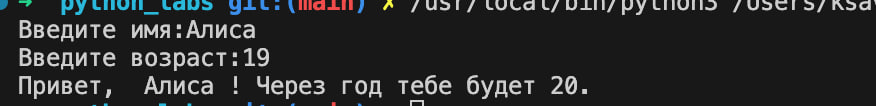

## Задание 2
```python
first_num=float(input().replace(',','.'))
second_num=float(input().replace(',','.'))
sum=first_num+second_num
avg=(first_num+second_num)/2
print(sum,round(avg,2))
```
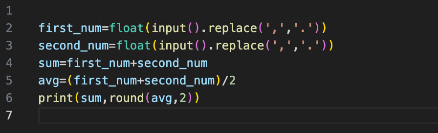

## Задание 3
```python
price=float(input())
discount=float(input())
vat=float(input())
base=price*(1-discount/100)
vat_amount=base*(vat/100)
total = base+vat_amount
print('База после скидки: 'f'{base:.2f}'' ₽', 'НДС: 'f'{vat_amount:.2f}'' ₽', 'Итого к оплате: 'f'{total:.2f}'' ₽',sep='\n')
```
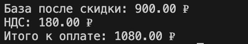

## Задание 4
```python
minutes=int(input())
count=0
hours=(minutes-minutes%60)//60
resmin=minutes%60
result=f'{str(hours)}' + ':' + f'{str(resmin)}'
print(result)
```
```python
m = int(input().strip())
hours = m // 60
minutes = m % 60
print(f"{hours}:{minutes:02d}")
```
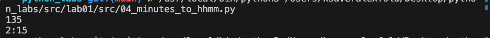
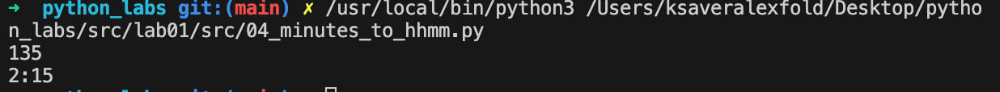

## Задание 5
```python
fio=str(input())
res=''
for i in range(len(fio)-1):
    if fio[i-1]==' ' and fio[i] in 'АБВГДЕЖЗИЙКЛМНОПРСТУФХЦЧШЩЪЫЬЭЮЯ':
        res+=str(fio[i])
k=2
for j in fio:
    if j!=' ':
        k+=1
print(res+'.',k)
```
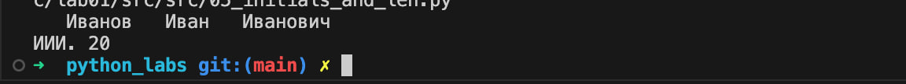
```python
name = str(input('ФИО: '))
abc1='ЙЦУКЕНГШЩЗХЪФЫВАПРОЛДЖЭЯЧСМИТЬБЮ'
l=0
count=0
letters=[]
m=-10**10
for r in range(len(name)):
    if name[r] in abc1:
        count+=1
        letters+=[name[r]]
        while count>3:
            if name[l] in abc1:
                count-=1
            l+=1
    m=max(m,r-l+1)
print(m,*letters,end='.')
```

## Задание 6
```python
n = int(input())
offline_count = 0
online_count = 0
for i in range(n):
    sub = input().split()
    if sub[-1] == 'True':online_count += 1
    else:offline_count += 1
print(online_count,offline_count)
```
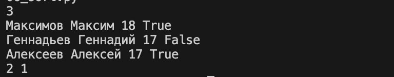

## Задание 7
```python
from string import *
sub='thisisabracadabraHt1eadljjl12ojh.'
abc1=ascii_uppercase
abc2=ascii_lowercase
count_first_letter=0
result=''
count_second_letter =0 
ind1=-1
ind2=-1
trueresult=''

for i in range(len(sub)-1):
    if sub[i] in ascii_uppercase:
        count_first_letter+=1
    if sub[i] in ascii_uppercase and count_first_letter==1:
        result+=sub[i]
        ind1=i
    if sub[i] in '0123456789' and sub[i+1] in abc2 :
        count_second_letter+=1
    if count_second_letter==1 and sub[i] in '0123456789' and sub[i+1] in abc2 :
        ind2=i+1
        result+=sub[i+1]
for i in range(ind1,len(sub),ind2-ind1):
    trueresult+=sub[i]
print(trueresult)
```
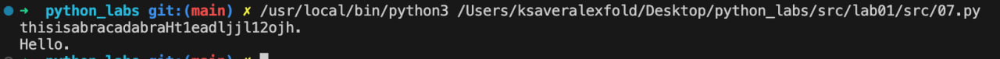

## Лабораторная работа 2
# Задание 1
# min_max
```python
arr1 = [3, -1, 5, 5, 0]
arr2 = [42]
arr3 = [-5, -2, -9]
arr4 = [1.5, 2, 2.0, -3.1]
arr5=[]
def min_max(nums: list[float | int]):
    n =[a for a in nums]
    if len(n)!=0:
        return min(n),max(n)
    if len(n)==0:
        raise ValueError
print(min_max(arr1))
print(min_max(arr2))
print(min_max(arr3))
print(min_max(arr4))
#print(min_max(arr5))
```
# unique_sorted
```python
def unique_sorted(nums: list[float | int]):
    a=sorted(set(x for x in nums))
    return a
arr3=[1.0,1,2.5,2.5,0]
arr2=[-1,-1,0,2,2]
arr1=[3,1,2,1,3]

print(f(arr1),f(arr2),f(arr3))
```
# flatten
```python
array1 = [[1, 2], [3, 4]]
array2 = [[1, 2], (3, 4, 5)]
array3 = [[1], [], [2, 3]]
array4=[[1, 2], "ab"]
def flatten(mat: list[list | tuple]):
    answer = []
    for n in mat:
        if isinstance(n,list) or isinstance(n,tuple):
            for y in n:
                answer += [y]
        else:
            raise TypeError
    return answer
print(flatten(array1))
print(flatten(array2))
print(flatten(array3))
print(flatten(array4))
```
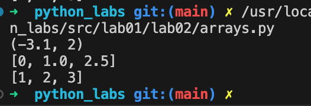

# Задание 2

# transpose
```python
def transpose(mat: list[list[float | int]]):
    res=[list(x) for x in zip(*mat)]
    for row in mat:
        if len(mat[0])!=len(row):
            raise ValueError
    return res
array1=[[1,2,3]]
array2=[[1],[2],[3]]
array3=[[1,2],[3,4]]
array4=[]
array5=[[1, 2], [3]]
print(transpote(array1))
print(transpote(array2))
print(transpote(array3))
print(transpote(array4))
print(transpote(array5))

```
# row_sums
```python

array1=[[1,2,3],[4,5,6]]
array2=[[-1,1],[10,-10]]
array3=[[0, 0], [0, 0]]
array4=[[1, 2], [3]]
def row_sums(mat: list[list[float | int]]):
    res=[sum(x) for x in mat]
    for row in mat:
        if len(mat[0])!=len(row):
            raise ValueError
    return res
print(row_sums(array1))
print(row_sums(array2))
print(row_sums(array3))
print(row_sums(array4))
```
# col_sums
```python
array1=[[1,2,3],[4,5,6]]
array2=[[-1,1],[10,-10]]
array3=[[0,0],[0,0]]
array4=[[1, 2], [3]]
def col_sums(mat: list[list[float | int]]):
    res=[sum(x) for x in zip(*mat)]
    for row in mat:
        if len(mat[0])!=len(row):
            raise ValueError
    return res
print(col_sums(array1))
print(col_sums(array2))
print(col_sums(array3))
print(col_sums(array4))
```
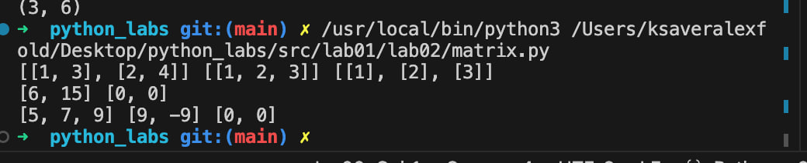

# Задание 3
```python
format_record(records: tuple[str, str, float]) -> str
    result=[]
    for rec in records:
        fio,group,gpa = rec
        cleaned_fio=[' '.join(fio.strip().split()),group,gpa]
        if len(cleaned_fio[0].split())>=3:
            name=cleaned_fio[0].split()[1][0].title()+'.'
            otch=cleaned_fio[0].split()[2][0].title()+'.'
            famil=cleaned_fio[0].split()[0].title()
            form = f'{famil} {name}{otch}'
            form_res=f'{form}, гр. {cleaned_fio[1]}, GPA {gpa:.2f}'
            result+=[form_res]
        if len(cleaned_fio[0].split())<=2:
            name=cleaned_fio[0].split()[1][0].title()+'.'
            famil=cleaned_fio[0].split()[0].title()
            form=f'{famil} {name}'
            form_res=f'{form}, гр. {cleaned_fio[1]}, GPA {gpa:.2f}'
            result+=[form_res]
    return result
test_cases = [
    ("Иванов Иван Иванович", "BIVT-25", 4.6),
    ("Петров Пётр", "IKBO-12", 5.0),
    ("  cидорова  анна   сергеевна ", "ABB-01", 3.999)
]
print(format_records(test_cases))
```
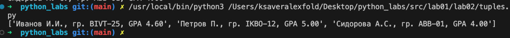
# Лабораторная работа 3
# Задание A
# normalize
```python 
import re
def normalize(text: str, *, casefold: bool = True, yo2e: bool = True): 
    if casefold:
        text = text.casefold()
    if yo2e:
        text = text.replace('ё', 'е').replace('Ё', 'Е')
    pattern= (r'[a-zA-Zа-яА-ЯёЁ0-9]+([-][a-zA-Zа-яА-ЯёЁ0-9]+)*')
    normalized = []
    for match in re.finditer(pattern, text):
        normalized.append(match.group())
    return ' '.join(normalized).strip()
test_cases = ["ПрИвЕт\nМИр\t","ёжик, Ёлка","Hello\r\nWorld","  двойные   пробелы  "]
for test in test_cases:
    result=normalize(test)
    print(result)
```
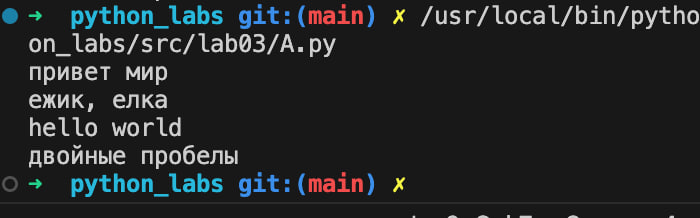
# tokenize
```python
from re import *
def tokenize(text):
    pattern = (r'[a-zA-Zа-яА-ЯёЁ0-9]+([-][a-zA-Zа-яА-ЯёЁ0-9]+)*')
    tokens = []
    for match in finditer(pattern,text):
        tokens.append(match.group())
    return tokens
test_cases = [
    "привет мир",
    "hello,world!!!",
    "no-настоящему круто", 
    "2025 год",
    "emoji 💬 не слово"
]
for text in test_cases:
    result = tokenize(text)
    print(result)
```
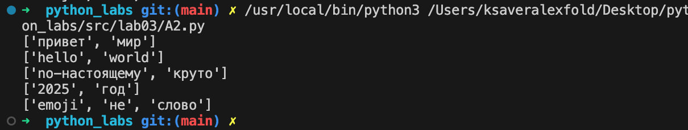
# count_freq+top_n
```python
def count_freq(tokens: list[str]):
    d={x:tokens.count(x) for x in set(tokens)}
    return sorted(d.items(),key=lambda x:-x[1])
test_case1 = (["a","b","a","c","b","a"])
test_case2=["bb","aa","bb","aa","cc"]
print(count_freq(test_case1),count_freq(test_case2))
```
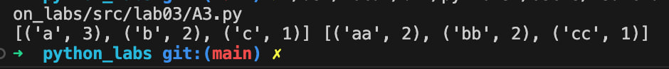
# Задание B
```py
import sys
from lib import text
table_mode=True
stroka = sys.stdin.readline()
tokenized = text.tokenize(stroka)
unique_words = text.count_freq(tokenized)
result = text.count_freq(unique_words)
top_words=result[:5]
if table_mode:
    max_word_ln=max(len(str(word[0][0])) for word in top_words)
    max_width=max(max_word_ln,5)
    print(f"\nТоп-5:")
    print(f"| {'слово':{max_width}} | {'частота'} |")
    print(f"|{'-' * (max_width + 2)}|---------|")
    for word_row in top_words:
        word=word_row[0][0]
        gusi= word_row[0][1]
        print(f"| {word:{max_width}} | {gusi:<7} |")
else:
    print(f"Топ-{5}:")
    for string in result:
        print(f'{string[0][0]}:{string[0][1]}')
```
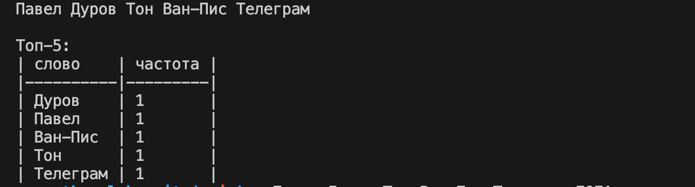

# Лабораторная работа #4
# Все реализованные функции для работы с csv файлами:
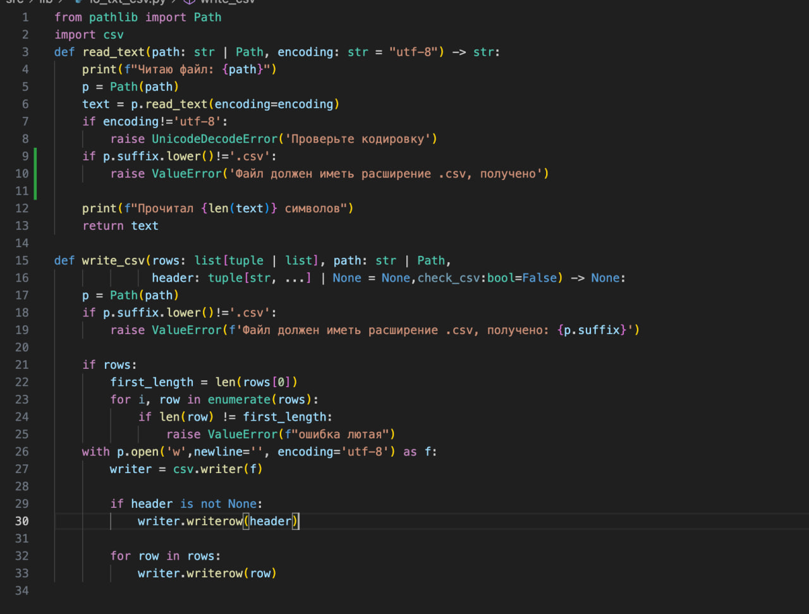
# Все реализованные функции для работы со словами:
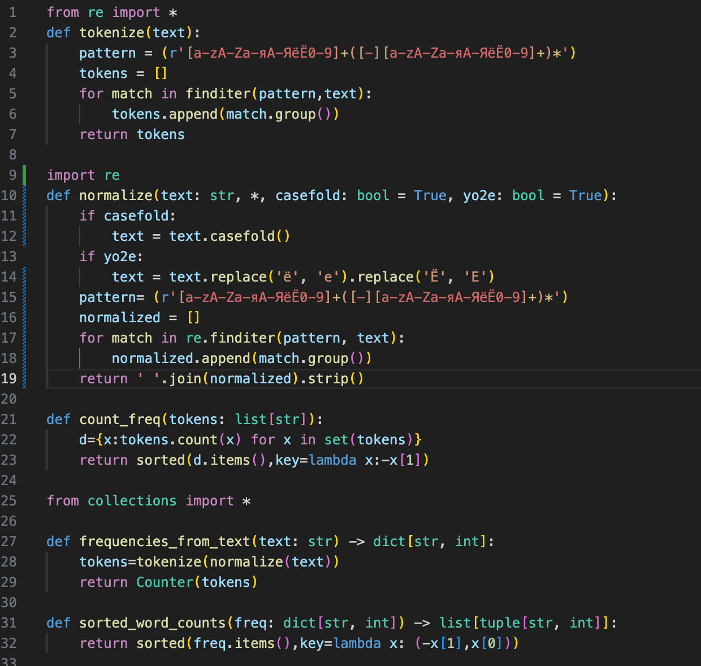

# Задание A
```py
import sys
from pathlib import Path

current_file = Path(__file__)
print(f"Текущий файл: {current_file}")

parent_dir = current_file.parent.parent
sys.path.append(str(parent_dir))

from lib.io_txt_csv import read_text,write_csv
result=read_text('src/data/input.txt')
test=[('крокодил',3),('мурад',3 )]
write_csv(test,'src/data/output.csv',header=('word','count'))
```
# Задание B
```py 
from pathlib import *
import sys 
current_file = Path(__file__)
print(f"Текущий файл: {current_file}")

parent_dir = current_file.parent.parent
sys.path.append(str(parent_dir))
from lib.io_txt_csv import *
from lib.text import *

input_file = "src/data/input_test.txt" 
output_file = "data/output.csv" 
encoding = "utf-8" 
input_path = Path(input_file)
if not input_path.exists():
    print(f"Ошибка: Файл '{input_file}' не найден.")
    print("Пожалуйста, проверьте правильность пути к файлу.")
else:
    file=read_text(input_file,encoding)
    freq = frequencies_from_text(file)
    sorted_words = sorted_word_counts(freq)
        
    csv_rows = [[word, count] for word, count in sorted_words]
    csv_header = ('word', 'count')
        
    total_words = sum(freq.values())
    unique_words = len(freq)
    print(f"Всего слов: {total_words}")
    print(f"Уникальных слов: {unique_words}")
    print("Топ 5 самых частых слов:")
        
    top_5 = sorted_words[:5]
    if top_5:
        for i, (word, count) in enumerate(top_5):
            print(f"  {i+1}. '{word}': {count}")
```
# на ввод заданию B был дан рассказ "Юшка" и вот что из этого вышло:


# Лабораторная работа #5
## csv -> json
```py
import json
import csv
from pathlib import Path
import sys
current_file = Path(__file__)
print(f"Текущий файл: {current_file}")

parent_dir = current_file.parent.parent
sys.path.append(str(parent_dir))


def csv_to_json(csv_path: str, json_path: str) -> None:
    encoding='utf-8'
    input_path=Path(csv_path)
    output_path=Path(json_path)
    if not input_path.exists():
        raise FileNotFoundError('пожалуйста, проверьте путь к файлу')
    if input_path.suffix.lower()!='.csv':
        raise ValueError('Проверьте расширение файла')
    data=[]
    with open(input_path,'r',encoding=encoding,newline='') as csv_file:
        csv_reader=csv.DictReader(csv_file)
        for row in csv_reader:
            data.append(row)
    with open(output_path,'w',encoding=encoding,newline='') as json_file:
        json.dump(data,json_file,ensure_ascii=False,indent=2 )
        print('Конвертация прошла успешно')
        print(f'Всего записей конвертировано:{len(data)}')
csv_to_json('src/data/people1.csv','src/data/people1.json')
```
## На ввод программе был дан .csv файл с данным содержимым:
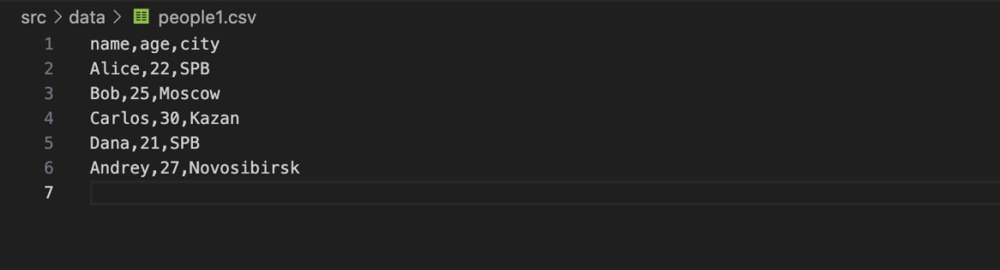
## результат записи: 
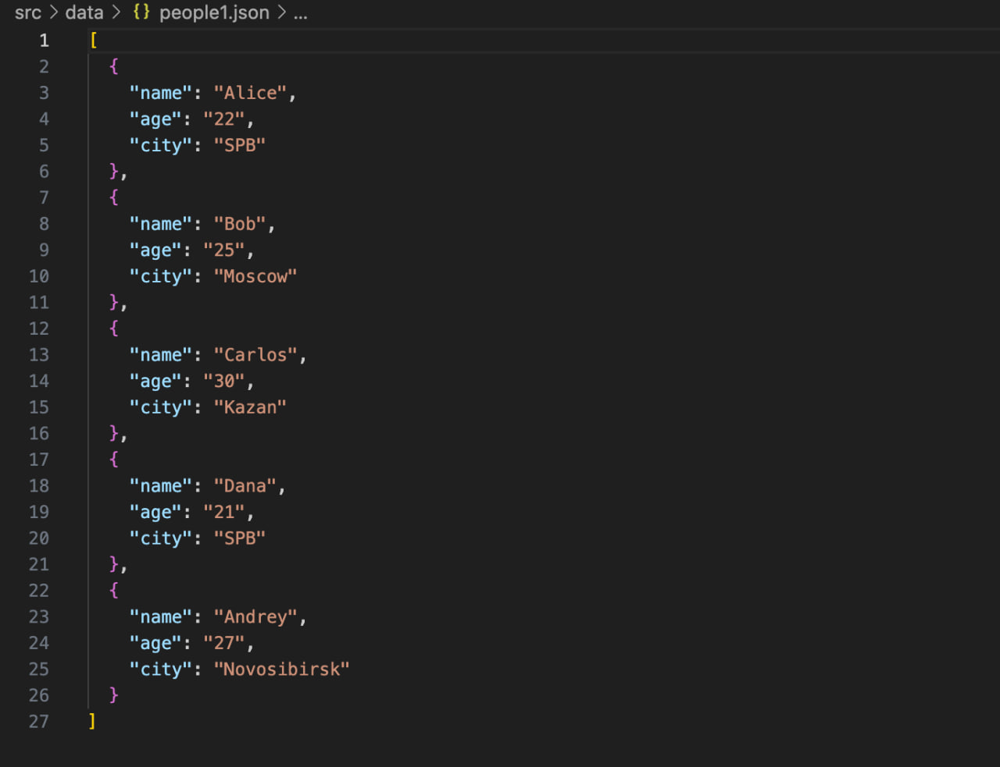

## json -> csv
```py
import json
import csv
from pathlib import Path
import sys
current_file = Path(__file__)
print(f"Текущий файл: {current_file}")
parent_dir = current_file.parent.parent
sys.path.append(str(parent_dir))
def json_to_csv(json_path: str | Path, csv_path: str | Path, encoding: str = "utf-8") -> None:
    input_path=Path(json_path)
    output_path=Path(csv_path)
    if not input_path.exists():
        raise FileNotFoundError(f"JSON файл не найден: {json_path}")
    with open(input_path,'r', encoding=encoding) as json_file:
        data = json.load(json_file)
    with open(output_path, 'w', newline='', encoding=encoding) as csv_file:
        writer = csv.DictWriter(csv_file, fieldnames=['name','age','city'])
        writer.writeheader()
        writer.writerows(data)
    print(f'Конвертировано {len(data)}')
json_to_csv('src/data/people2.json','src/data/people2.csv')
```
## На ввод программе был дан .json файл с данным содержимым:

## результат записи: 

# csv -> xlsx
```py
import csv
from openpyxl import Workbook
from pathlib import Path
import sys
current_file = Path(__file__)
print(f"Текущий файл: {current_file}")

parent_dir = current_file.parent.parent
sys.path.append(str(parent_dir))

def csv_to_xlsx(csv_path: str | Path, xlsx_path: str | Path, encoding: str = "utf-8") -> None:

    csv_file = Path(csv_path)
    xlsx_file = Path(xlsx_path)
    
    if not csv_file.exists():
        raise FileNotFoundError(f"CSV файл не найден: {csv_path}")
    
    workbook = Workbook()
    worksheet = workbook.active
    worksheet.title = "Data"
    
    with open(csv_file, 'r', encoding='utf-8', newline='') as csv_open:
        csv_reader = csv.reader(csv_open)
        
        for row_index, row in enumerate(csv_reader,1):
            for col_index, value in enumerate(row,1):
                worksheet.cell(row=row_index, column=col_index, value=value)
    workbook.save(xlsx_file)
    print(f"Успешно сконвертировано: {csv_path} -> {xlsx_path}")
csv_to_xlsx('src/data/people.csv','src/data/test_for_xlsx.xlsx')
```
## На ввод программе был дан .csv файл с данным содержимым:

## В результате перезаписи получаем это:


