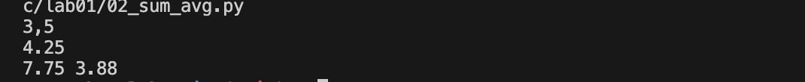

# python_labs

# Лабораторная работа 1


## Задание 1
```python
name=str(input('Введите имя:'))
age=int(input('Введите возраст:'))
print('Привет, ', f'{name}''!' ' Через год тебе будет ' f'{age+1}''.')
```


## Задание 2
```python
first_num=float(input().replace(',','.'))
second_num=float(input().replace(',','.'))
sum=first_num+second_num
avg=(first_num+second_num)/2
print(sum,round(avg,2))
```


## Задание 3
```python
price=float(input())
discount=float(input())
vat=float(input())
base=price*(1-discount/100)
vat_amount=base*(vat/100)
total = base+vat_amount
print('База после скидки: 'f'{base:.2f}'' ₽', 'НДС: 'f'{vat_amount:.2f}'' ₽', 'Итого к оплате: 'f'{total:.2f}'' ₽',sep='\n')
```


## Задание 4
```python
minutes=int(input())
count=0
hours=(minutes-minutes%60)//60
resmin=minutes%60
result=f'{str(hours)}' + ':' + f'{str(resmin)}'
print(result)
```
```python
m = int(input().strip())
hours = m // 60
minutes = m % 60
print(f"{hours}:{minutes:02d}")
```


## Задание 5
```python
fio=str(input())
res=''
for i in range(len(fio)-1):
    if fio[i-1]==' ' and fio[i] in 'АБВГДЕЖЗИЙКЛМНОПРСТУФХЦЧШЩЪЫЬЭЮЯ':
        res+=str(fio[i])
k=2
for j in fio:
    if j!=' ':
        k+=1
print(res+'.',k)
```

```python
name = str(input('ФИО: '))
abc1='ЙЦУКЕНГШЩЗХЪФЫВАПРОЛДЖЭЯЧСМИТЬБЮ'
l=0
count=0
letters=[]
m=-10**10
for r in range(len(name)):
    if name[r] in abc1:
        count+=1
        letters+=[name[r]]
        while count>3:
            if name[l] in abc1:
                count-=1
            l+=1
    m=max(m,r-l+1)
print(m,*letters,end='.')
```

## Задание 6
```python
n = int(input())
offline_count = 0
online_count = 0
for i in range(n):
    sub = input().split()
    if sub[-1] == 'True':online_count += 1
    else:offline_count += 1
print(online_count,offline_count)
```


## Задание 7
```python
from string import *
sub='thisisabracadabraHt1eadljjl12ojh.'
abc1=ascii_uppercase
abc2=ascii_lowercase
count_first_letter=0
result=''
count_second_letter =0 
ind1=-1
ind2=-1
trueresult=''

for i in range(len(sub)-1):
    if sub[i] in ascii_uppercase:
        count_first_letter+=1
    if sub[i] in ascii_uppercase and count_first_letter==1:
        result+=sub[i]
        ind1=i
    if sub[i] in '0123456789' and sub[i+1] in abc2 :
        count_second_letter+=1
    if count_second_letter==1 and sub[i] in '0123456789' and sub[i+1] in abc2 :
        ind2=i+1
        result+=sub[i+1]
for i in range(ind1,len(sub),ind2-ind1):
    trueresult+=sub[i]
print(trueresult)
```


## Лабораторная работа 2
# Задание 1
# min_max
```python
def f(n):
    a=[x for x in n]
    return min(a),max(a)
arr1=[1.5, 2,-3.1]
arr2=[42]
arr3=[-5,-2,-9]
arr4=[1.5,2,2.0,-3.1]
print(f(arr1),f(arr2),f(arr3),f(arr4))
```
# unique_sorted
```python
def f(n):
    a=sorted(set(x for x in n))
    return a
arr3=[1.0,1,2.5,2.5,0]
arr2=[-1,-1,0,2,2]
arr1=[3,1,2,1,3]

print(f(arr1),f(arr2),f(arr3))
```
# flatten
```python
def f(n):
    res=[]
    for x in n:
        for y in x:
            res+=[y]
    return res
arr3=[[1],[],[2,3]]
arr2=[[1,2],(3,4,5)]
arr1=[[1,2],[3,4]]
print(f(arr1),f(arr2),f(arr3))
```


# Задание 2

# transpose
```python
def f(matrix):
    return [list(row) for row in zip(*matrix)]
arr1=[[1,2,3]]
arr2=[[1],[2],[3]]
arr3=[[1,2],[3,4]]
print(f(arr3),f(arr2),f(arr1))
```
# row_sums
```python

def f(n):
    res=[sum(x) for x in n]
    return res
arr1=[[1,2,3],[4,5,6]]
arr2=[[-1,1],[10,-10]]

print(f(arr1),f(arr2))
```
# col_sums
```python
def f(n):
    return [sum(x) for x in zip(*n)]
arr1=[[1,2,3],[4,5,6]]
arr2=[[-1,1],[10,-10]]
arr3=[[0,0],[0,0]]
print(f(arr1),f(arr2),f(arr3))

```


# Задание 3
```python
def f(records):
    result=[]
    for rec in records:
        fio,group,gpa = rec
        cleaned_fio=[' '.join(fio.strip().split()),group,gpa]
        if len(cleaned_fio[0].split())>=3:
            name=cleaned_fio[0].split()[1][0].title()+'.'
            otch=cleaned_fio[0].split()[2][0].title()+'.'
            famil=cleaned_fio[0].split()[0].title()
            form = f'{famil} {name}{otch}'
            form_res=f'{form}, гр. {cleaned_fio[1]}, GPA {gpa:.2f}'
            result+=[form_res]
        if len(cleaned_fio[0].split())<=2:
            name=cleaned_fio[0].split()[1][0].title()+'.'
            famil=cleaned_fio[0].split()[0].title()
            form=f'{famil} {name}'
            form_res=f'{form}, гр. {cleaned_fio[1]}, GPA {gpa:.2f}'
            result+=[form_res]
    return result
test_cases = [
    ("Иванов Иван Иванович", "BIVT-25", 4.6),
    ("Петров Пётр", "IKBO-12", 5.0),
    ("  cидорова  анна   сергеевна ", "ABB-01", 3.999)
]
print(f(test_cases))
```

## Лабораторная работа 3
# Задание A
# normalize
```python 
def normalize(text: str, *, casefold: bool = True, yo2e: bool = True):
    text=text.replace('ё','е').replace('Ё','Е')
    text=text.replace('\t',' ').replace('\r',' ').replace('\n',' ')
    text=text.split()
    new_text=' '.join(text)
    return new_text.strip().lower()
test1="ПрИвЕт\nМИр\t"
test2="ёжик, Ёлка"
test3="Hello\r\nWorld"
test4="  двойные   пробелы  "
print(normalize(test1),normalize(test2),normalize(test3),normalize(test4),sep='\n')
```

# tokenize
```python
from re import *
def tokenize(text):
    pattern = (r'[a-zA-Zа-яА-ЯёЁ0-9]+([-][a-zA-Zа-яА-ЯёЁ0-9]+)*')
    tokens = []
    for match in finditer(pattern,text):
        tokens.append(match.group())
    return tokens
test_cases = [
    "привет мир",
    "hello,world!!!",
    "no-настоящему круто", 
    "2025 год",
    "emoji 💬 не слово"
]
for text in test_cases:
    result = tokenize(text)
    print(result)
```

# count_freq+top_n
```python
def count_freq(tokens: list[str]):
    d={x:tokens.count(x) for x in set(tokens)}
    return sorted(d.items(),key=lambda x:-x[1])
test_case1 = (["a","b","a","c","b","a"])
test_case2=["bb","aa","bb","aa","cc"]
print(count_freq(test_case1),count_freq(test_case2))
```

# Задание B
``````python


